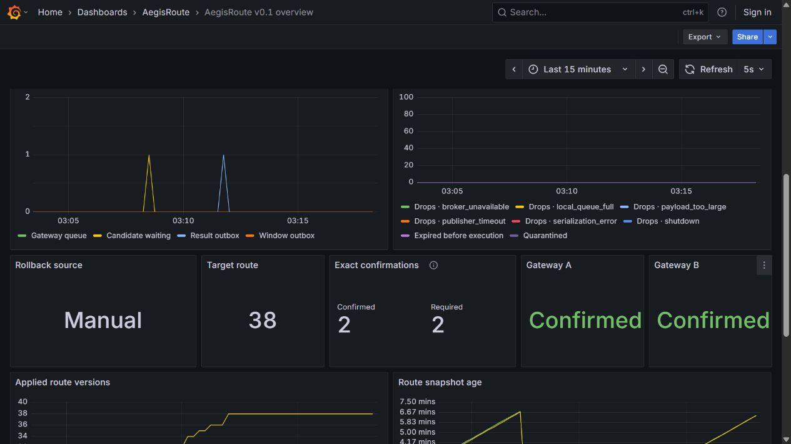
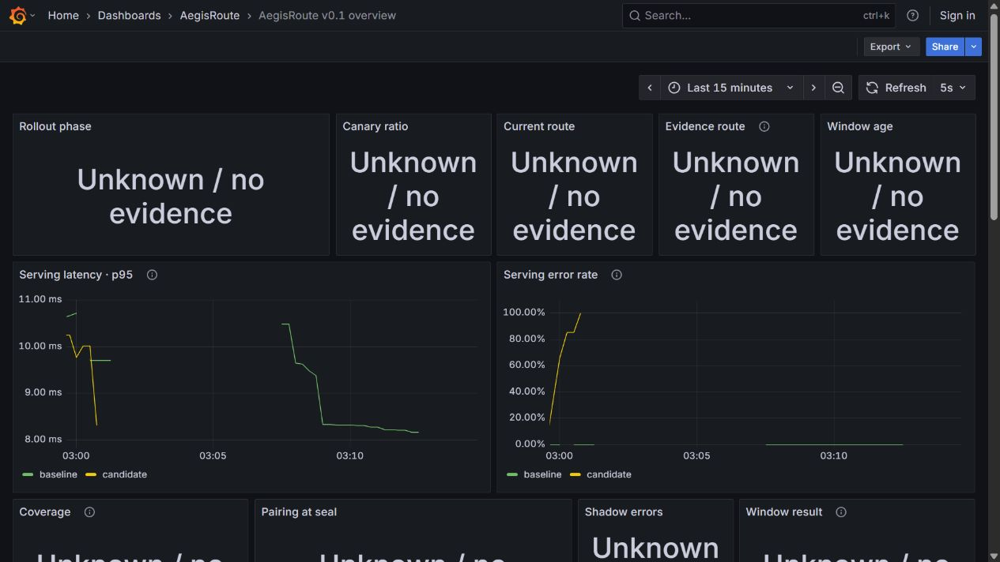

# Synthetic reliability evidence, 2026-09-05

This contains a curated export of the completed local run `aegisroute-20260905-002645`
and separately attributed records from the delivery rerun `delivery-03`.
It is evidence for a synthetic v0.1 slice, not a release or production assessment.
The complete 472-file archive, including unsuccessful attempts and SQLite files,
remains in the original local worktree. The original selection contains 113 artifacts
(about 4.4 MB); large JSON exports are losslessly compressed, not summarized away.
The `delivery/` records and their manifests are additional to that original count.

## Provenance and independent recomputation

[provenance.json](provenance.json) records every selected file's original path,
SHA-256 and byte count, plus its packed hash. The original source inventory hash is
`39086a2711ffa095286abffb8ab9cbf81f4ddfc4533962217641c5c28dcf4778` at source HEAD
`9983b647225cd4ec6ba6702785c1839be3225df9`. [Original source hashes](original-source-files.json)
include inherited documents and four historical Python cache files; those files
are not all proposed for submission. A new delivery record describes packaging
changes separately; the original acceptance has not been re-labelled as a new run.

```powershell
python scripts/reliability/verify_bundle.py
```

The verifier checks hashes, decompresses into a temporary local directory and
recomputes sample digests, window counts, Control payloads, original receipts,
exact rollback ACKs, all six measurement rounds and their route/sample joins.
It also compares the four saved crash/recovery/replay business-fact snapshots.
No Docker, model vendor, credentials or live service is required for this check.
To execute a new live run, follow the [reproduction guide](../../../scripts/reliability/README.md).

## Delivery rerun

The new isolated project `aegis-delivery-20260905-03` completed successfully with
exit code 0. [Delivery validation](delivery-validation.json), [source hashes](delivery-source-files.json)
and [delivery provenance](delivery-provenance.json) bind these results separately
from the original measurement run. These manifests capture local preparation before
publication; later publication status wording is outside that captured source tree.
The runner used offset +10000 and was stopped
afterward; its volumes and complete raw output remain local.

| Gate | New observed result | Record |
|---|---|---|
| Wrapper rebuild | 94 tasks; 85 tests including 17 PostgreSQL integration tests; no failures/errors/skips | [Test suites](delivery/test-suites.json) |
| Process scenario and reconciliation | 355 samples, 707 records, 20 sealed windows; all windows match Control and have receipts; two decisions with exact A/B ACKs | [Reconciliation](delivery/scenario/reconciliation.json), [timeline](delivery/scenario/timeline.json) |
| HTTP/SSE and isolation | 14 cases pass; broker loss/drop counters and baseline latency bound pass | [Transport](delivery/transport/PASS.json), [broker isolation](delivery/scenario/broker-isolation.json) |
| Online policy convergence | 1101.66 ms, strictly below 5000 ms; offline manual rollback checked separately | [Server-timestamp calculation](delivery/scenario/online-convergence.json) |
| Control outage and startup | Both cached Gateways continue serving; fresh processes without a snapshot are live but not ready and return the exact 503 code; recovery restores readiness | [Startup snapshots](delivery/startup-snapshot.json) |
| Dependency process recovery | PostgreSQL/Redpanda restart counts each increase 0→1; both become healthy, five baseline JSON/SSE probes succeed, route remains 11 | [Automatic recovery](delivery/automatic-recovery.json) |

The six running Java service instances matched their rebuilt local JAR hashes.
Those archive hashes differ from the original build. A recursive comparison of all
decompressed application and nested-JAR entries found identical file names and
contents; see [JAR comparison](delivery/jar-content-comparison.json). The original
142 apps/modules/contracts source files also remain byte-identical. This does not
turn the original benchmark into a measurement of the delivery rerun.

No new benchmark or UI recording was made during delivery preparation. Earlier
delivery attempts remain recorded as failures: server-window alignment in run 01
and an inconsistent final export in run 02. Harness fixes preserved all policy,
latency and reconciliation assertions. Remote CI had not run at this evidence
capture; checks on the published PR head must be read separately.

## Original saved outcomes

| Gate | Observed result | Raw evidence |
|---|---|---|
| Wrapper | 85 tests including 17 PostgreSQL integration tests; 0 failures/errors/skips | [Suite counts](original/test-results-final.json) |
| Actual HTTP/SSE | 14 cases; cancellation, pre/post-token errors, JSON stream routing and DONE | [Response frames](original/transport-04/transport-results.json), [provider counts](original/transport-04/provider-counts.json) |
| Worker kill, Control outage, replay | 504 samples / 1,016 records / 32 windows unchanged; pending receipt 1→0 | [Timeline](original/scenario-04/timeline.json), compressed checkpoint facts, [committed offsets](original/scenario-04/business-replay-offsets.txt) |
| Human canary | Four explicit 1/10/50/100 approvals, each using fresh current-route evidence | [Timeline](original/scenario-04/timeline.json), qualification records |
| Automatic/manual rollback | One policy and one manual rollback in scenario-04; B offline stays unconfirmed | [Policy rollback](original/scenario-04/automatic-rollback.json), [offline B](original/scenario-04/offline-target.json), [final state](original/scenario-04/final-status.json) |
| Full reconciliation | 43 scenario windows, later 73 benchmark windows match persisted Control results | [Scenario reconciliation](original/scenario-04/reconciliation.json), offline verifier |
| Measurements | 1,440 requests, 720 shadow-on pairs, no observed errors/drops | [Analysis](original/benchmark-01/analysis.json), per-round observations/requests/metrics/Docker samples |
| UI/database fault | Stale ACK health becomes unknown; baseline SSE remains 200/DONE, recovery restores health | [Fault](original/ui-db-outage/PASS.json), [SSE](original/ui-db-outage/baseline-sse.json) |

The 43/73 window totals and five/eight decision totals in raw files include earlier
history in the same saved service volumes. They are not counts of newly induced
decisions in scenario-04. Its own timeline identifies the one policy and one manual
rollback. Its final route is 26; the later benchmark cleanup reached route 38.
These are recorded outcomes, not assertions about currently running services.

## Measurement limits

Each of three repetitions used off then on, 240 identical seeded requests, at most
four client threads and a paced 20 requests/second. Warm processes, 20 warmup requests,
22-second flush, new TCP connection per request. Observed p95 on-minus-off:
**−1.724, −0.325, +0.653 ms**. The fixed order, shared Windows/Docker host, JIT and
scheduling introduce noise; these are not significant speedup or zero-overhead claims.
Worker/candidate CPU increases are visible in saved Docker observations. Resource
samples are sparse snapshots, not continuous peaks. Cold-start latency and saturation
were not measured. Source run device: Windows 11 / Core Ultra 9 275HX, 24 logical CPUs;
Docker allocated 16 CPUs, approximately 23.5 GiB; Temurin 21.0.11+10, Python 3.12.10.





The original short CDP recording and all its timestamped frames remain local; they
are not included in this compact bundle. Screenshots above are actual runtime
captures, not generated designs.

## Three evidence-supported case points

1. Built a recoverable evidence path for a synthetic Java inference gateway; verified
   unchanged 504-sample/1,016-record state across Worker SIGKILL and a Control outage,
   then replayed 60 records with new event IDs without growing business-fact counts.
2. Made rollout decisions traceable to fresh evidence and exact convergence; exercised
   four human canary stages, deterministic rollback and an offline Gateway that
   remained pending until the exact target route ACK arrived.
3. Measured isolation with actual clients: 14 HTTP/SSE cases and six matched load
   rounds, reporting p95 differences and additional shadow resource use without
   claiming production capacity or zero overhead.

## 中文说明

本目录的原冻结验收精选导出共 113 项约 4.4 MB；完整 472 项记录、失败尝试、SQLite
数据库和录像仍在原工作树。大 JSON 使用无损 gzip，原文与压缩文件分别保留哈希。
`verify_bundle.py` 可脱离运行服务复算窗口、回执、ACK、六轮测量及恢复/重放前后的事实。

本次 `delivery-03` 使用全新隔离项目验收通过：Wrapper 94 任务、85 测试（含 17 集成），
14 个 HTTP/SSE 用例；355 样本、707 记录、20 个窗口完成对账，两个回滚决定均获精确
A/B 确认，在线策略回滚耗时 1101.66 ms（<5000 ms）。Control 故障下的缓存服务、
无快照启动、PostgreSQL/Redpanda 自动恢复也通过。记录见上面的 delivery 链接，
新增记录不计入原 113 项。新 JAR 压缩包哈希不同，递归解包后的全部文件内容相同。

交付阶段未重跑基准或录像，原始测量仍绑定旧源码和运行记录，不覆盖历史报告。
43/73 窗口及 5/8 决策含服务历史累计值；scenario-04 自身只新增一个
策略回滚和一个手动回滚。截图来自真实运行页面，记录状态不等于当前仍在运行。

范围仅限合成数据、单个持久 Worker 和固定 A/B 网关。磁盘丢失、HA、真实 provider
副作用、冷启动性能/饱和、生产 IAM、合规与云部署未验证；不得据此扩张宣传。
