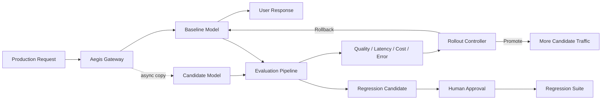
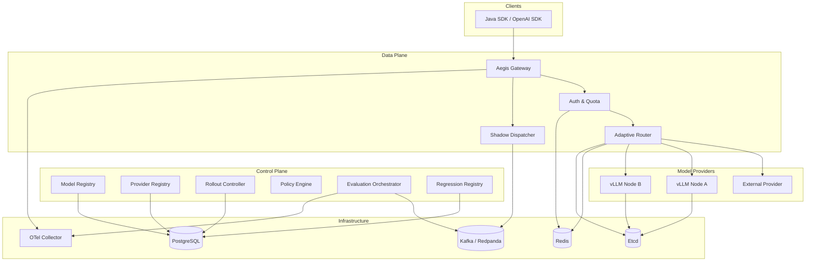
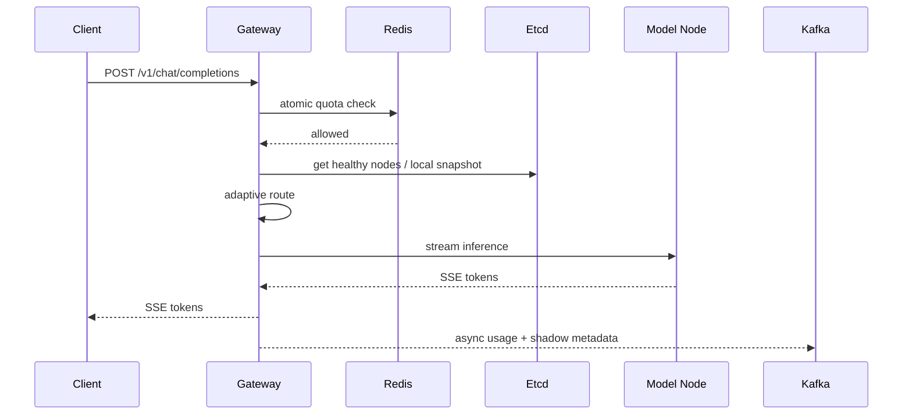
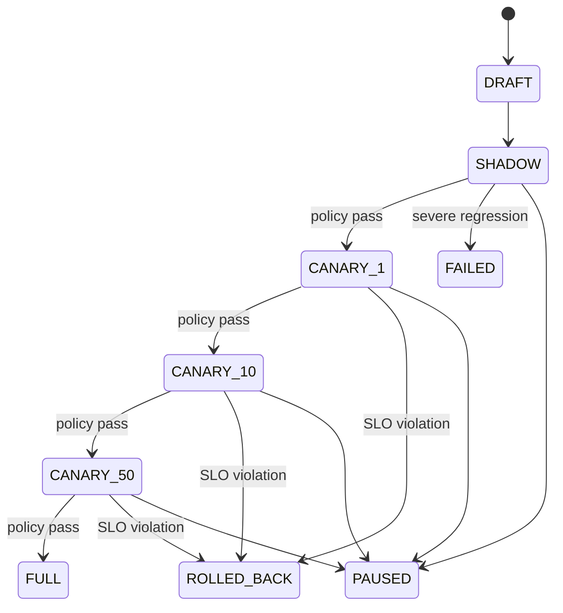

# AegisRoute 产品设计文档

> 历史归档：本文保存早期产品探索，不是当前实现合同。其中 Spring Boot 3、Redis、Etcd、React 等方案已被 v0.1 冻结基线取代。当前权威规格见 [最终产品文档](product.md)、[架构说明](architecture.md) 与仓库根目录 `AGENTS.md`。

> **定位**：面向生产级 AI 推理流量的安全发布、动态路由与持续评测控制平面
> **一句话**：让一个新模型、新版本或新推理节点在接触真实用户流量前，先经过影子流量、在线评测、渐进式灰度和自动回滚，并在高并发下保持可观测、可限流、可容错。
> **目标**：作为一个完全独立的求职主项目，吸收 4 个参考项目中最有工程含量的能力，但不复制它们的业务、代码结构和成品功能。

---

## 0. 文档信息

- 项目名：**AegisRoute**
- 英文副标题：**Safe Rollout & Adaptive Routing Control Plane for AI Inference**
- 主语言：Java 21
- 后端：Spring Boot 3 + WebFlux
- 数据面协议：OpenAI-compatible HTTP/SSE
- 核心基础设施：PostgreSQL、Redis、Kafka/Redpanda、Etcd、OpenTelemetry
- 可观测性：Prometheus + Grafana + OpenTelemetry
- 部署：Docker Compose；Kubernetes 作为 v1.1 可选扩展
- 文档版本：v0.1
- 设计日期：2026-08-12

---

# 1. 参考项目与可迁移精髓

本项目参考以下 4 个公开项目/课程的**工程思想**，不直接复制课程业务和源码。

1. 高并发亿级流量点赞系统
2. Spring Boot + Dubbo + React 企业级 API 开放平台
3. Spring AI 企业级 AI 大模型评测平台
4. `liyupi/yu-rpc`

核心原则：

> **只提炼问题解决方法，不把四套项目堆成“技术栈拼盘”。**

最终产品必须拥有新的领域模型、新的数据模型、新的关键流程、新的核心算法和新的工程目标。

---

# 2. 参考项目一：高并发亿级流量点赞系统

参考：

- https://www.codefather.cn/course/1912696290659577857
- https://github.com/liyupi/yu-like

## 2.1 原项目核心内容

原项目围绕高并发点赞业务，从“能用”逐步演进到“高性能”和“高可用”，主要包含：

- Spring Boot 3 + Java 21
- Redis 多数据结构缓存
- Lua 脚本保证 Redis 多命令原子性
- 消息队列异步解耦
- 批量消息消费与批量落库
- TiDB / 分布式数据库
- HeavyKeeper 热点检测
- TTL 本地热点缓存
- DB / Cache / MQ 多级降级
- Prometheus + Grafana 可观测性
- Alertmanager 告警
- Nginx 反向代理和负载均衡
- 高并发压测与性能优化

它真正有价值的不是“点赞”这个业务，而是：

> **如何把一个简单写请求，演进成一个可承受高并发、能削峰、能降级、能定位性能问题的生产系统。**

## 2.2 本项目提取的精髓

AegisRoute 只吸收以下部分：

### A. Redis + Lua 原子限流与预算控制

原项目用 Lua 解决并发状态更新问题。

AegisRoute 将这个思想迁移到：

- API 请求限额
- Token 配额
- 每日预算
- 租户并发上限
- 模型并发上限

一次 Lua 脚本完成原子判断与扣减，避免：

```text
GET quota
→ application check
→ SET quota
```

产生竞态。

### B. 异步消息削峰

原项目通过消息队列将高并发写流量异步化。

AegisRoute 中迁移为：

```text
在线推理请求
   |
   +---- 主模型同步返回给用户
   |
   +---- 影子模型结果异步写入 evaluation topic
                                  |
                                  v
                              Eval Worker
```

用户请求不等待评测任务完成。

### C. 热点识别和本地缓存

HeavyKeeper 不用于“热门点赞对象”，而用于：

- Hot tenant
- Hot model
- Hot routing policy
- Hot prompt fingerprint

高频模型路由配置进入 Caffeine 本地缓存，减少 Redis / PostgreSQL 查询。

### D. 多级降级

迁移成：

- Redis 故障时的 quota 策略
- Kafka 故障时暂停影子评测，但不影响在线推理
- Etcd 故障时使用 last-known-good 节点快照
- Judge 模型故障时降级为 deterministic evaluator
- Candidate 模型故障时自动停止灰度

### E. 真实可观测与压测

必须输出真实：

- QPS
- P50 / P95 / P99
- TTFT
- gateway overhead
- error rate
- retry amplification
- Kafka backlog
- rollback latency

---

# 3. 参考项目二：企业级 API 开放平台

参考：

- https://www.codefather.cn/course/1790979723916521474

## 3.1 原项目核心内容

该项目是一个开发者 API 开放平台，典型能力包括：

- Spring Boot
- React
- API 接口发布与管理
- 用户开通接口调用权限
- 在线调试
- 客户端 SDK
- API 签名认证
- Spring Cloud Gateway
- Dubbo RPC
- Nacos
- 调用统计
- 多系统协作

真正值得迁移的是：

> **把内部能力包装为受认证、受计量、受限流、可观测、可供第三方稳定调用的平台。**

## 3.2 本项目提取的精髓

### A. OpenAI-compatible Gateway

AegisRoute 对开发者暴露标准接口：

```http
POST /v1/chat/completions
```

调用方不关心后面实际是：

- OpenAI
- Gemini
- Anthropic
- OpenRouter
- vLLM
- Ollama
- 自建推理节点

### B. API Key + HMAC 签名

提供：

- `api_key`
- `secret`
- timestamp
- nonce
- signature

管理控制面的高风险操作使用签名认证。

普通 OpenAI-compatible 数据面可使用 Bearer API Key。

### C. SDK

提供 Java SDK：

```java
AegisClient client = AegisClient.builder()
    .baseUrl("http://localhost:8080")
    .apiKey("...")
    .build();

client.chat(...)
```

SDK 负责：

- authentication
- timeout
- request-id
- retry eligibility
- SSE stream parsing

### D. Gateway 与业务解耦

Gateway 只负责：

- auth
- quota
- routing
- streaming
- telemetry

不会承担：

- 模型管理后台 CRUD
- 评测任务实现
- rollout 状态机

---

# 4. 参考项目三：AI 大模型评测平台

参考：

- https://www.codefather.cn/course/2029864890566553602

## 4.1 原项目核心内容

公开介绍中包含：

- Spring Boot 3 / Java 21
- Spring AI
- OpenRouter 多模型统一接入
- 1~8 模型并排对比
- SSE 流式响应
- WebFlux / Flux 并行调用
- Prompt Lab
- RabbitMQ 异步批量评测
- 多评委 AI 交叉评分
- Token 统计
- 成本监控
- 可视化报告
- WebSocket 进度推送
- Redis / Caffeine 缓存
- 限流和安全护栏

真正值得迁移的是：

> **统一模型调用、异步批量评测、质量/性能/成本多维比较，以及“评测结果可进入工程决策”。**

## 4.2 本项目提取的精髓

### A. 多 Provider 统一模型接口

抽象：

```java
public interface ModelProvider {
    ProviderCapabilities capabilities();
    Flux<ChatChunk> stream(ChatRequest request);
    Mono<ChatResponse> chat(ChatRequest request);
}
```

### B. Shadow Evaluation

不是用户主动打开“模型对比页面”，而是：

> 用生产请求的副本评估 candidate 模型。

主模型结果返回用户。

Candidate 在后台执行。

### C. 多维评测

每个 sample 至少记录：

- response correctness / quality
- latency
- TTFT
- token usage
- estimated cost
- error
- timeout
- schema validity
- tool-call validity

### D. Multi-Judge

质量评测可采用：

```text
Deterministic Evaluator
+
Judge A
+
Judge B
```

但 **LLM Judge 不能直接决定是否上线**。

它只能形成 `quality_score` 的一部分。

### E. 回归样本库

严重失败样本可以成为永久 Regression Suite：

```text
线上失败
→ 自动生成候选 regression case
→ 人工审批
→ 固化到 regression suite
→ 下一模型版本必须重新跑
```

---

# 5. 参考项目四：liyupi/yu-rpc

参考：

- https://github.com/liyupi/yu-rpc

## 5.1 原项目核心内容

`yu-rpc` 是基于 Java + Etcd + Vert.x 的 RPC 框架，公开 README 中涵盖：

- Vert.x 网络服务器
- Etcd / ZooKeeper 注册中心
- SPI
- 多序列化器
- 动态代理
- 自定义网络协议
- TCP 编解码
- 粘包半包
- 负载均衡
- 一致性 Hash
- 重试
- 容错
- 服务心跳和续期
- 服务下线
- 消费端服务缓存
- Etcd Watch
- Spring Boot Starter
- 注解驱动

其真正有价值的部分是：

> **服务发现、扩展机制、路由、故障感知、重试/容错，以及框架边界设计。**

## 5.2 本项目提取的精髓

### A. SPI → Provider Plugin

AegisRoute 需要支持多模型提供方。

使用插件机制：

```text
ModelProvider
    |
    +-- OpenAIProvider
    +-- GeminiProvider
    +-- OpenRouterProvider
    +-- VllmProvider
    +-- MockProvider
```

禁止在核心逻辑中出现大量：

```java
if (provider == OPENAI) ...
else if (provider == GEMINI) ...
```

### B. Etcd → Inference Node Registry

Etcd 不用于普通 Spring 服务注册，而专门维护**自托管推理节点**。

节点：

```json
{
  "nodeId": "qwen3-gpu-01",
  "model": "qwen3-8b",
  "endpoint": "http://10.0.0.12:8000",
  "accelerator": "GPU",
  "maxConcurrency": 32,
  "region": "eu-west",
  "version": "2026-08-12",
  "weight": 100
}
```

使用 Lease：

```text
Node starts
  ↓
Put /aegis/nodes/{nodeId}
  ↓
Lease TTL 15s
  ↓
Heartbeat every 5s
  ↓
Node dies
  ↓
Lease expires
  ↓
Gateway removes node
```

### C. Load Balancer → Adaptive Inference Router

实现并比较：

- Round Robin
- Weighted Round Robin
- Least Active
- Consistent Hash
- Adaptive Score

最终主推 Adaptive。

### D. Retry/Fault Tolerance → Failure Classifier

AI 流式请求不能盲目 retry。

分类：

```text
Connect timeout before stream
→ retry/fallback allowed

HTTP 429 before stream
→ backoff/fallback allowed

HTTP 500 before stream
→ retry may be allowed

HTTP 400
→ no retry

SSE 已经输出 token 后断开
→ no transparent retry
```

### E. 不迁移的部分

以下内容虽然适合学习，但不放入 AegisRoute v1：

- 自定义 RPC 二进制协议
- 自研序列化框架
- ZooKeeper 与 Etcd 双实现
- TCP Server 从零开发
- 动态代理 RPC Stub

原因：

> AegisRoute 的北向兼容目标是 OpenAI HTTP/SSE，南向也已有 HTTP/gRPC 生态。为了“展示技术”强行加自研 RPC 会降低架构合理性。

---

# 6. 四个项目的精髓融合矩阵

| 来源 | 提取能力 | AegisRoute 中的落点 |
|---|---|---|
| 高并发点赞 | Redis + Lua | tenant quota / token budget |
| 高并发点赞 | MQ 削峰 | shadow evaluation pipeline |
| 高并发点赞 | HeavyKeeper | hot model / tenant cache |
| 高并发点赞 | 多级降级 | Redis/Kafka/Etcd/Judge degraded mode |
| 高并发点赞 | Prometheus/Grafana | inference observability |
| API 开放平台 | API Gateway | OpenAI-compatible gateway |
| API 开放平台 | API Key / 签名 | tenant authentication |
| API 开放平台 | SDK | Java SDK |
| API 开放平台 | 调用统计 | usage & billing metrics |
| AI 评测平台 | 多模型统一接入 | Provider SPI |
| AI 评测平台 | SSE | streaming inference |
| AI 评测平台 | 异步评测 | evaluation worker |
| AI 评测平台 | 多评委 | quality scoring |
| AI 评测平台 | Token / Cost | rollout cost dimension |
| yu-rpc | SPI | model/provider plugins |
| yu-rpc | Etcd + Lease | inference node registry |
| yu-rpc | LB | adaptive node routing |
| yu-rpc | retry/fault | failure classifier + fallback |
| yu-rpc | 服务缓存 | local node snapshot |

---

# 7. 独立产品：AegisRoute

## 7.1 产品问题

企业替换或升级一个生产 AI 模型时，常见风险：

1. Benchmark 好不代表真实用户流量好。
2. Candidate 模型可能质量提高，但延迟和成本恶化。
3. 自托管节点可能部分过载或失联。
4. 流式响应开始后发生故障，无法简单 retry。
5. 一次错误模型上线可能影响所有用户。
6. 通用 AI Gateway 往往解决“统一调用”，但不解决“如何安全上线一个新模型”。
7. 线下评测结果和线上异常无法自动形成持续 regression suite。

AegisRoute 要解决：

> **如何把一个候选模型从 0% 真实流量，安全提升到 100%，并在过程中自动收集证据、控制风险、发现回归和执行回滚。**

---

# 8. 核心产品价值

AegisRoute 的四个关键词：

```text
Route
Shadow
Evaluate
Rollout
```

最终形成闭环：



---

# 9. 用户与使用场景

## 9.1 用户角色

### Platform Engineer

负责：

- Provider
- inference node
- route
- quota
- rollout

### ML / AI Engineer

负责：

- candidate model
- evaluation rubric
- regression dataset

### Developer

只关心：

```http
POST /v1/chat/completions
```

### SRE

关注：

- latency
- errors
- node health
- rollback
- saturation
- queue backlog

---

# 10. 产品边界

## 10.1 v1 要做

- OpenAI-compatible Chat Completion
- SSE streaming
- external provider plugins
- self-hosted inference node registry
- Etcd lease / heartbeat
- API key / quota
- Redis Lua 限流
- adaptive routing
- provider fallback
- shadow traffic
- async evaluation
- deterministic evaluators
- multi-judge
- cost / latency / error tracking
- rollout controller
- canary traffic
- automatic rollback
- Prometheus metrics
- OTel tracing
- basic UI
- Java SDK

## 10.2 v1 不做

- 自研大模型
- 模型训练
- RAG
- MCP
- 通用 Agent 平台
- 自研 RPC binary protocol
- Kubernetes Operator
- billing/payment
- 多区域容灾
- 完整 IAM 系统
- 自研 MQ / service registry

---

# 11. 系统架构

采用清晰的 **Control Plane / Data Plane** 分离。



---

# 12. 模块设计

## 12.1 `aegis-gateway`

职责：

- OpenAI-compatible API
- auth
- quota
- routing
- retry eligibility
- SSE proxy
- shadow dispatch
- request metrics

不负责：

- evaluation
- rollout decision
- admin CRUD

---

## 12.2 `aegis-control-plane`

职责：

- tenant
- API key
- model
- provider
- route policy
- rollout
- cost metadata
- evaluation policy

---

## 12.3 `aegis-node-agent`

部署于自托管推理节点旁。

职责：

- register
- heartbeat
- publish node capabilities
- publish concurrency
- publish health

示例：

```text
vLLM
 |
 +-- node-agent
       |
       +---- Etcd Lease
       +---- Prometheus metrics
```

---

## 12.4 `aegis-evaluator`

消费：

```text
evaluation.requested
```

执行：

1. deterministic evaluator
2. quality judge
3. latency comparison
4. cost comparison
5. schema validator

输出：

```text
evaluation.completed
```

---

## 12.5 `aegis-rollout-controller`

维护状态：

```text
DRAFT
  ↓
SHADOW
  ↓
CANARY_1
  ↓
CANARY_10
  ↓
CANARY_50
  ↓
FULL
```

异常可以进入：

```text
PAUSED
ROLLED_BACK
FAILED
```

---

# 13. 数据面请求流程

## 13.1 正常请求



---

# 14. Shadow Traffic

Shadow 是产品差异化核心。

原则：

> Candidate 的执行不能增加用户可感知响应时间。

## 14.1 请求

```text
                    ┌──────── baseline ────────► user
Client ─► Gateway ──┤
                    └──────── candidate ───────► evaluation
```

Candidate：

- independent timeout
- independent circuit breaker
- independent concurrency budget

不能：

- block baseline
- consume baseline retry budget
- modify user response

---

# 15. Provider SPI

接口：

```java
public interface ModelProvider {

    String type();

    ProviderCapabilities capabilities();

    Mono<ChatResponse> chat(
        ProviderContext context,
        ChatRequest request
    );

    Flux<ChatChunk> stream(
        ProviderContext context,
        ChatRequest request
    );
}
```

v1 实现：

- `OpenRouterProvider`
- `OpenAICompatibleProvider`
- `MockProvider`

`OpenAICompatibleProvider` 可支持：

- vLLM
- Ollama
- LocalAI
- compatible self-hosted model server

---

# 16. Etcd Node Registry

Key：

```text
/aegis/nodes/{model}/{nodeId}
```

Value：

```json
{
  "nodeId": "node-a",
  "model": "qwen3-8b",
  "endpoint": "http://10.0.0.12:8000",
  "version": "v7",
  "accelerator": "GPU",
  "region": "local",
  "maxConcurrency": 16,
  "weight": 100
}
```

Runtime metrics 不全部写 Etcd。

动态指标通过 Prometheus / local telemetry 获取，例如：

- active requests
- p95 latency
- recent error rate

Etcd 负责：

- membership
- endpoint
- capabilities
- lease
- lifecycle

---

# 17. Adaptive Routing

支持：

```text
ROUND_ROBIN
WEIGHTED
LEAST_ACTIVE
CONSISTENT_HASH
ADAPTIVE
```

## 17.1 Adaptive Score

一个可解释的初版：

```text
loadScore =
    activeRequests / maxConcurrency

latencyScore =
    recentP95 / targetP95

errorScore =
    recentErrorRate

score =
    0.45 * loadScore
  + 0.35 * latencyScore
  + 0.20 * errorScore
```

选择：

```text
lowest score
```

实际实现需要：

- normalized range
- EWMA
- minimum sample threshold
- unhealthy threshold

## 17.2 求职展示实验

使用相同流量比较：

```text
Round Robin
vs
Least Active
vs
Adaptive
```

记录：

- P95
- P99
- node load variance
- error rate

---

# 18. Redis Lua 配额系统

配额类型：

```text
requests/min
tokens/min
tokens/day
cost/day
concurrent requests
```

请求开始：

```text
reserve
```

请求完成：

```text
reconcile actual token/cost
```

Lua 原子处理：

```text
check
+
reserve
+
expiry
```

如果不足：

```http
HTTP 429
```

---

# 19. Retry 与 Fallback

这是一个必须讲深的设计点。

## 19.1 Failure Classifier

```text
DNS/connect timeout before any response
→ retry YES

HTTP 429 before stream
→ retry/fallback YES

HTTP 502/503 before stream
→ retry/fallback MAYBE

HTTP 400
→ NO

HTTP 401
→ NO

SSE started then connection broke
→ transparent retry NO
```

原因：

如果已经向客户端输出：

```text
token1
token2
token3
```

再切换节点重新生成，可能导致内容重复和语义不一致。

---

# 20. Evaluation Pipeline

Kafka Topic：

```text
aegis.evaluation.requested
aegis.evaluation.completed
aegis.usage
```

每个 evaluation sample：

```json
{
  "requestId": "...",
  "baselineModel": "model-a",
  "candidateModel": "model-b",
  "promptFingerprint": "...",
  "baseline": {
    "latencyMs": 720,
    "ttftMs": 210,
    "tokens": 430
  },
  "candidate": {
    "latencyMs": 580,
    "ttftMs": 160,
    "tokens": 390
  }
}
```

---

# 21. Evaluator 类型

## 21.1 Deterministic

优先级最高。

例如：

- valid JSON
- JSON schema
- regex
- exact match
- required fields
- tool-call schema
- max output length

## 21.2 LLM Judge

仅用于：

- helpfulness
- correctness where deterministic answer unavailable
- clarity
- preference

建议：

```text
Judge A
Judge B
```

出现明显分歧：

```text
UNCERTAIN
```

而不是强行平均。

---

# 22. Rollout Policy

创建：

```json
{
  "baseline": "model-a",
  "candidate": "model-b",
  "shadowPercent": 10,

  "policy": {
    "minimumSamples": 500,
    "maxErrorRate": 0.01,
    "maxP95LatencyRatio": 1.20,
    "maxCostRatio": 0.85,
    "minQualityDelta": -0.02
  }
}
```

Candidate eligible：

```text
samples >= 500
AND
errorRate <= 1%
AND
p95(candidate) <= p95(baseline) * 1.2
AND
cost(candidate) <= cost(baseline) * 0.85
AND
qualityDelta >= -0.02
```

---

# 23. Rollout 状态机



---

# 24. 自动回滚

触发示例：

```text
candidate_error_rate > 5%
for 3 consecutive windows
```

或者：

```text
candidate_p95 >
baseline_p95 * 1.5
```

回滚目标：

```text
candidate traffic → 0
```

要求：

> **控制面作出回滚决定后，数据面应在 5 秒内停止把新请求路由给 candidate。**

这是目标 SLO，不是未经测试的性能声明。

---

# 25. Regression Suite

重大 regression：

```text
production shadow failure
   ↓
RegressionCandidate
   ↓
Human Review
   ↓
Approved
   ↓
RegressionSuite
```

以后每次 candidate：

```text
offline regression suite
→ pass
→ shadow traffic
```

---

# 26. Agent 模块（v1.1）

Agent 不是系统真值来源。

只做两个任务。

## 26.1 Regression Case Assistant

输入：

- baseline output
- candidate output
- evaluator evidence
- request trace

输出候选：

```yaml
name: structured-json-regression
assertions:
  - valid_json
  - schema: schemas/result.json
```

必须人工审批。

## 26.2 Failure Explanation Assistant

输入：

- OTel trace
- error logs
- route decision
- rollout status
- metric snapshot

输出：

- probable failure chain
- evidence links
- suggested investigation

**PASS/FAIL 与 rollout decision 必须由 deterministic policy 决定。**

---

# 27. 数据模型

## 27.1 tenants

```text
id
name
status
created_at
```

## 27.2 api_keys

```text
id
tenant_id
key_hash
secret_hash
status
created_at
expires_at
```

## 27.3 providers

```text
id
type
name
endpoint
secret_ref
enabled
```

## 27.4 models

```text
id
provider_id
model_key
display_name
input_price
output_price
capabilities
enabled
```

## 27.5 routes

```text
id
tenant_id
route_key
baseline_model_id
routing_strategy
policy_json
```

## 27.6 rollouts

```text
id
route_id
baseline_model_id
candidate_model_id
state
candidate_percent
policy_json
created_at
updated_at
```

## 27.7 evaluation_samples

```text
id
rollout_id
request_id
baseline_latency
candidate_latency
baseline_cost
candidate_cost
quality_score
result
created_at
```

## 27.8 regression_cases

```text
id
name
source
input_json
assertion_json
status
created_at
```

---

# 28. API 设计

## 28.1 Data Plane

```http
POST /v1/chat/completions
GET  /v1/models
```

## 28.2 Control Plane

```http
POST /api/v1/providers
GET  /api/v1/providers

POST /api/v1/models
GET  /api/v1/models

POST /api/v1/routes
GET  /api/v1/routes/{id}

POST /api/v1/rollouts
GET  /api/v1/rollouts/{id}

POST /api/v1/rollouts/{id}/start-shadow
POST /api/v1/rollouts/{id}/promote
POST /api/v1/rollouts/{id}/pause
POST /api/v1/rollouts/{id}/rollback

GET /api/v1/nodes
GET /api/v1/regressions
POST /api/v1/regressions/{id}/approve
```

---

# 29. 可观测性

## 29.1 Metrics

Gateway：

```text
aegis_requests_total
aegis_request_duration_seconds
aegis_ttft_seconds
aegis_gateway_overhead_seconds
aegis_tokens_total
aegis_cost_total
```

Routing：

```text
aegis_node_active_requests
aegis_node_error_rate
aegis_route_decisions_total
aegis_retry_total
aegis_fallback_total
```

Evaluation：

```text
aegis_shadow_requests_total
aegis_evaluation_backlog
aegis_evaluation_duration_seconds
aegis_quality_delta
```

Rollout：

```text
aegis_rollout_state
aegis_rollbacks_total
aegis_candidate_traffic_ratio
```

---

# 30. Trace

一个请求：

```text
gateway.request
 ├── quota.check
 ├── route.select
 ├── provider.stream
 │    ├── connect
 │    └── receive
 └── shadow.enqueue
```

Shadow：

```text
evaluation
 ├── candidate.inference
 ├── deterministic.evaluate
 ├── judge.a
 ├── judge.b
 └── rollout.observe
```

---

# 31. 高可用与降级矩阵

| 故障 | 行为 |
|---|---|
| PostgreSQL 短暂不可用 | Data Plane 使用只读缓存的 route snapshot |
| Redis 不可用 | 默认 fail-closed quota；开发环境可切 fail-open |
| Kafka 不可用 | 停止 shadow enqueue，在线流量继续 |
| Etcd 不可用 | 使用 last-known-good node snapshot，停止接纳新节点 |
| Candidate timeout | 记录失败，不影响 baseline |
| Baseline provider 429 | 若尚未开始 stream，可 fallback |
| Judge unavailable | deterministic score 保留，quality 标记 pending |
| Grafana down | 不影响请求 |
| Control Plane down | Data Plane 使用已发布 route snapshot |

---

# 32. 安全设计

必须做：

- API key hash，不明文存储
- provider secret 不落普通业务表
- secret 通过 env / Docker secret
- HMAC control-plane signature
- nonce replay protection
- request body 默认不长期保存
- Prompt fingerprint 使用 hash
- evaluation sample 支持 PII redaction
- Admin API 与 Data Plane 分开
- 影子模型不能调用生产写工具

v1 不实现完整 IAM。

---

# 33. Repository 结构

建议：

```text
aegis-route/
├── aegis-gateway/
├── aegis-control-plane/
├── aegis-evaluator/
├── aegis-node-agent/
├── aegis-provider-api/
├── aegis-provider-openai/
├── aegis-provider-mock/
├── aegis-sdk-java/
├── aegis-common/
├── deployment/
│   ├── docker/
│   └── prometheus/
├── loadtest/
├── demo/
│   ├── mock-inference-node/
│   └── sample-client/
├── docs/
│   ├── architecture.md
│   ├── rollout.md
│   ├── failure-model.md
│   └── adr/
└── README.md
```

---

# 34. 架构实施原则

## 34.1 先模块化单体，后拆分

第一阶段可以运行：

```text
gateway process
control process
evaluator process
```

不要为了“微服务”拆十几个服务。

## 34.2 不造已有基础设施轮子

直接使用：

- Etcd
- Kafka/Redpanda
- Redis
- PostgreSQL
- OTel
- Prometheus
- Grafana

自己实现的应该是：

- routing
- rollout
- shadow traffic
- evaluation integration
- failure policy

---

# 35. 测试策略

## 35.1 Unit Tests

重点：

- quota Lua semantics
- failure classification
- routing strategy
- rollout state transitions
- policy evaluation
- cost calculation

## 35.2 Integration Tests

Testcontainers 启：

- PostgreSQL
- Redis
- Kafka
- Etcd

验证：

```text
node registration
→ gateway discovery
→ request routing
→ evaluation
→ rollout
```

## 35.3 Contract Tests

所有 Provider 必须通过同一套：

```text
chat
stream
timeout
429
500
malformed response
cancel
```

## 35.4 Chaos Tests

人为注入：

- candidate +3000 ms
- candidate 20% HTTP 500
- node death
- Redis unavailable
- Kafka unavailable
- Etcd unavailable
- provider 429

## 35.5 Load Test

使用 k6。

---

# 36. 性能与可靠性目标

以下均为**设计目标，需要最终用真实 benchmark 验证**。

### Data Plane

- Gateway 自身 P95 overhead：`< 20 ms`
- Redis quota check P95：`< 5 ms`
- route decision P95：`< 2 ms`
- shadow candidate 不增加 baseline response critical path

### Rollout

- severe failure detection：`< 30 s`
- rollback route propagation：`< 5 s`

### Reliability

- candidate 100% failure 时 baseline success rate 不因 shadow 执行下降
- Kafka 故障不影响 baseline data plane
- dead node 的 Etcd lease 到期后不再被选择

---

# 37. 必须做的性能实验

最终 README 不能写“高性能”，必须有真实数字。

## Experiment 1：Routing Algorithm

```text
Round Robin
Least Active
Adaptive
```

比较：

- P95
- P99
- error
- node utilization variance

## Experiment 2：Shadow Overhead

```text
shadow 0%
shadow 10%
shadow 50%
shadow 100%
```

测用户响应 overhead。

## Experiment 3：Redis Lua Quota

比较：

```text
application-side GET/SET
vs
Lua atomic check
```

## Experiment 4：Node Failure

运行 3 nodes。

kill 1 node。

测：

```text
error spike
detection time
recovery time
```

## Experiment 5：Automatic Rollback

Candidate 注入：

```text
15% 500
```

测：

```text
detection
→ rollback
→ stable
```

---

# 38. Demo 剧本

最终 Demo 控制在 2~3 分钟。

## Step 1

三台 mock inference nodes：

```text
baseline-a
candidate-b-1
candidate-b-2
```

Etcd 页面/CLI 显示节点在线。

## Step 2

运行 baseline：

```text
1000 requests
```

展示：

```text
P95
TTFT
Cost
Error
```

## Step 3

开启 candidate 20% shadow。

用户流量继续只返回 baseline。

展示 candidate evaluation。

## Step 4

Policy pass。

手动 promote 到 10%。

## Step 5

注入：

```text
candidate HTTP 500 = 15%
```

看到：

```text
SLO violation
→ AUTO ROLLBACK
→ candidate traffic 0%
```

## Step 6

kill candidate-b-1。

Etcd lease 到期。

Router 自动只选 b-2。

这一个 Demo 同时证明：

- gateway
- service discovery
- distributed routing
- observability
- evaluation
- rollout
- failure handling

---

# 39. 6 周开发路线

## Week 1 — Gateway MVP

完成：

- Spring Boot
- OpenAI-compatible API
- Mock Provider
- OpenRouter/OpenAI-compatible provider
- SSE
- PostgreSQL model metadata
- Docker Compose

Definition:

```text
Client → Aegis → Provider → Stream
```

---

## Week 2 — Platform Layer

完成：

- API key
- Redis
- Lua quota
- usage metrics
- Java SDK
- basic admin API

---

## Week 3 — RPC 精髓迁移

完成：

- Etcd
- node-agent
- Lease heartbeat
- local node snapshot
- Round Robin
- Least Active
- Adaptive router
- failure classifier

---

## Week 4 — Shadow + Evaluation

完成：

- Kafka
- shadow dispatcher
- evaluator
- deterministic checks
- one judge implementation
- latency/token/cost comparison

---

## Week 5 — Rollout

完成：

- rollout state machine
- policy engine
- canary traffic
- auto rollback
- regression candidates

---

## Week 6 — Production Proof

完成：

- Prometheus
- Grafana
- OTel
- chaos tests
- k6
- benchmarks
- README
- architecture diagrams
- demo video
- v1.0.0

---

# 40. v1 Definition of Done

只有以下全部完成才算项目结束。

- [ ] OpenAI-compatible chat endpoint
- [ ] SSE streaming
- [ ] Provider SPI
- [ ] 至少 2 个 Provider 实现
- [ ] API key auth
- [ ] Redis Lua quota
- [ ] Java SDK
- [ ] Etcd node registry
- [ ] Lease heartbeat
- [ ] node death 自动摘除
- [ ] 3 个 routing strategies
- [ ] FailureClassifier
- [ ] safe retry
- [ ] provider fallback
- [ ] shadow traffic
- [ ] Kafka evaluation pipeline
- [ ] deterministic evaluator
- [ ] one LLM judge
- [ ] token/cost tracking
- [ ] rollout state machine
- [ ] canary
- [ ] automatic rollback
- [ ] regression candidate
- [ ] Prometheus
- [ ] Grafana
- [ ] OTel trace
- [ ] integration test
- [ ] chaos test
- [ ] k6 benchmark
- [ ] architecture.md
- [ ] 3 ADR
- [ ] demo video
- [ ] v1.0 release

完成后停止继续堆 feature。

---

# 41. 推荐 ADR

## ADR-001：OpenAI-compatible HTTP/SSE instead of custom RPC

记录：

- 为什么北向不用自研 RPC
- 为什么 RPC 课程中的协议实现不适合本产品

## ADR-002：Etcd only for inference membership

记录：

- Etcd 保存什么
- PostgreSQL 保存什么
- Prometheus 保存什么

## ADR-003：Shadow execution must be outside user critical path

记录：

- latency isolation
- independent timeout
- independent concurrency budget

## ADR-004：No transparent retry after SSE begins

这是非常有面试价值的一篇。

## ADR-005：LLM Judge is evidence, not rollout authority

证明 AI 工程判断能力。

---

# 42. 招聘能力映射

## AWS / Amazon

项目可证明：

- distributed control plane
- async workflow
- partial failure
- retry/fallback
- high-availability thinking
- observability
- service lifecycle

## Google Cloud / SRE

可证明：

- distributed systems
- routing
- reliability
- performance experiments
- metrics/tracing
- failure debugging

## Qualcomm / QT Technologies

如果进一步使用：

- local vLLM/Ollama
- CPU/GPU/NPU node metadata
- node load balancing
- performance profiling

可以向：

- edge inference
- system software
- performance engineering

方向解释。

## Accenture / TCS / Cognizant

可证明：

- Java enterprise backend
- Spring
- API gateway
- Redis
- Kafka
- database
- distributed integration
- observability
- AI platform engineering

---

# 43. 简历描述模板

最终数字必须换成真实 benchmark。

## AegisRoute — Safe AI Inference Rollout & Adaptive Routing Platform

**Java 21, Spring Boot, WebFlux, Redis, Kafka, Etcd, PostgreSQL, OpenTelemetry**

- Built an OpenAI-compatible inference gateway supporting shadow traffic and progressive model rollouts, allowing candidate models to be evaluated on production-like requests without entering the user response critical path.
- Designed an Etcd-backed inference-node registry with leased heartbeats and adaptive routing based on active concurrency, latency and recent failure signals.
- Implemented atomic tenant request/token budgets with Redis Lua, stream-aware retry/fallback rules, and automatic rollback based on quality, latency, error-rate and cost SLOs.
- Built an asynchronous evaluation pipeline combining deterministic checks and model-based judges, converting approved production regressions into a persistent regression suite.
- Load-tested the data plane at **X req/s** with **Y ms P95 gateway overhead**, and demonstrated rollback within **Z seconds** under injected candidate failures.

---

# 44. 面试必须讲得清楚的 12 个问题

1. 为什么不用现成 LiteLLM 直接结束？
2. AegisRoute 真正差异化的能力是什么？
3. 为什么用 Etcd，而不是 Redis 做 node registry？
4. Etcd 故障时数据面怎么办？
5. 为什么 SSE 开始后不能 transparent retry？
6. Shadow traffic 怎么保证不影响用户延迟？
7. Adaptive Router 的指标如何防止抖动？
8. Redis Lua quota 如何避免竞态？
9. Kafka 挂掉为什么不能影响主请求？
10. LLM Judge 不稳定，怎么做 rollout decision？
11. Candidate 在 10% canary 时失败，多久能回滚？
12. 如果流量增长 100 倍，系统第一个瓶颈会在哪里？

---

# 45. 与课程项目保持独立的约束

为了保证这个项目能被当作“自己的项目”，执行以下规则：

1. **不复制课程源码。**
2. 不沿用 `yu-like`、API 平台、AI 评测平台、`yu-rpc` 的包结构。
3. 不复制数据库表。
4. 不做课程原业务 UI。
5. 所有核心领域命名围绕：
   - route
   - model
   - node
   - rollout
   - evaluation
   - regression
6. 每一个中间件必须能回答：
   > 如果去掉它，哪个明确需求无法满足？
7. 自研能力只聚焦：
   - adaptive routing
   - shadow isolation
   - rollout policy
   - failure classification
   - evaluation integration
8. 最终仓库必须包含真实性能实验，而不是课程宣称的“亿级”“高性能”。

---

# 46. 项目最终叙事

不要把项目描述成：

> 我把点赞系统 + RPC + API 平台 + AI 评测平台缝起来了。

而应该描述成：

> 我在研究高并发系统、API gateway、RPC service discovery 和 AI model evaluation 的工程模式后，重新设计了一套面向生产 AI inference 的安全发布控制平面。它将 inference node discovery、adaptive routing、shadow traffic、continuous evaluation 和 progressive rollout 放在一条完整的可靠性链路中。

这才是 AegisRoute 的核心独立性。

---

# 47. 参考资料

1. 高并发亿级流量点赞系统
   https://www.codefather.cn/course/1912696290659577857

2. `liyupi/yu-like`
   https://github.com/liyupi/yu-like

3. Spring Boot + Dubbo + React 企业级 API 开放平台
   https://www.codefather.cn/course/1790979723916521474

4. Spring AI 企业级 AI 大模型评测平台
   https://www.codefather.cn/course/2029864890566553602

5. `liyupi/yu-rpc`
   https://github.com/liyupi/yu-rpc

---

# 48. 最终决策摘要

**项目：AegisRoute**

保留四个参考项目的精髓：

```text
High Concurrency
    ↓
Redis/Lua + MQ + Degradation + Observability

API Platform
    ↓
Gateway + Auth + SDK + Usage

AI Evaluation
    ↓
Multi-provider + SSE + Evaluation + Cost

yu-rpc
    ↓
SPI + Etcd + Load Balancing + Fault Tolerance
```

重新组合成新的产品核心：

```text
OpenAI Gateway
       ↓
Adaptive Inference Routing
       ↓
Shadow Traffic
       ↓
Continuous Evaluation
       ↓
Progressive Rollout
       ↓
Automatic Rollback
       ↓
Regression Suite
```

**这条链路就是整个项目最值得证明的工程能力。**
