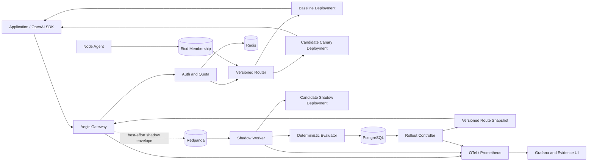
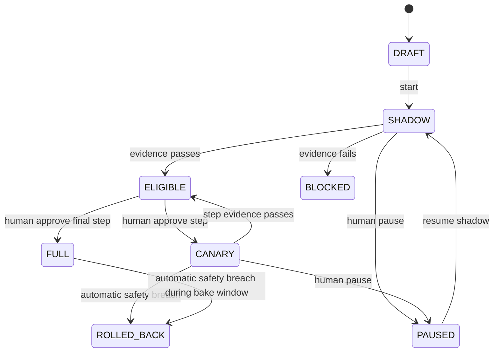

# AegisRoute 最终版产品文档

> **Product**: AegisRoute
> **English subtitle**: Evidence-based Rollout and Adaptive Routing for AI Inference
> **Document version**: 1.0
> **Date**: 2026-08-12
> **Status**: v0.1 implementation in progress; local build, integration, Compose and two-Gateway rollback path verified; GitHub CI and release evidence pending
> **Primary purpose**: Independent portfolio project for Ireland-based backend, platform, cloud operations and AI infrastructure roles

## 0. 文档使用方式

本文是收敛后的最终产品与工程规格，定义“构建什么、为什么构建、如何验收”。仓库已具备 Java/Gradle 多模块源码、合同测试、Testcontainers 集成测试、Compose 拓扑与自动回滚验收脚本；2026-08-12 的本地合成数据验收已证明双 Gateway 回滚闭环。Ubuntu/Windows GitHub CI、Release、GHCR、SBOM、provenance、Grafana 截图和三分钟演示仍待产生，因此当前不能声称 v0.1.0 Release DoD 已完成，也不能把本地结果描述为生产性能。

公开仓库以英文 README 为入口；本文归档在 `docs/zh-CN/`，当前简明产品合同见同目录 `product.md`。

---

## 1. Product summary

### 1.1 One-line pitch

> AegisRoute helps platform teams evaluate a candidate AI model on production-like traffic, approve a gradual rollout, and automatically remove it when deterministic safety signals regress.

### 1.2 产品定位

AegisRoute 是一个面向 AI 推理流量的安全发布与路由平台。它位于应用与模型 Provider/自托管推理节点之间，对外提供 OpenAI-compatible API，对内管理：

```text
Route → Shadow → Evaluate → Approve → Canary → Roll back → Learn
```

产品的核心不是“能调用多少模型”，而是：

> **如何让一次模型或推理节点变更在进入更多真实流量前拥有可审查证据，并在发生确定性退化时快速、可解释地回滚。**

### 1.3 产品类型

- 对使用方：兼容 OpenAI Chat Completions 的推理入口；
- 对平台工程师：模型发布控制面；
- 对 SRE：可观测、可注入故障、可回滚的推理数据面；
- 对求职作品集：可重复证明 Java 后端、分布式协调、可靠性和性能实验能力的工程项目。

### 1.4 不作出的商业声明

AegisRoute 不宣称是市场上第一个或功能最完整的 AI Gateway。统一 Provider、路由、可观测、评测和发布分别已有成熟工具。项目价值来自对一个明确可靠性问题的自主建模、实现、取舍和可重复验证，而不是技术名词数量。

---

## 2. Problem statement

### 2.1 用户问题

一个团队准备把 `candidate-v2` 替换为线上 `baseline-v1` 时，会面对：

1. 离线 benchmark 与实际请求分布不同；
2. 质量、延迟、错误率和成本可能朝不同方向变化；
3. 流式响应输出后不能无痕重试；
4. candidate 或单个自托管节点可能只在部分流量下过载；
5. 一次错误发布可能瞬间影响全部用户；
6. 线上失败样本通常没有进入下一版本的回归测试；
7. 缺少一条把“观察”转成“发布决定”和“回滚证据”的审计链。

### 2.2 Jobs to be done

**Platform Engineer**

> 当我注册一个候选模型时，我希望先用隔离的影子执行观察它，在证据满足策略后人工批准少量真实流量，并确保异常时系统自动移除 candidate。

**ML/AI Engineer**

> 当我提交一个新模型版本时，我希望看到它相对 baseline 的质量、结构有效性、延迟和成本差异，并把严重失败变成可复现回归用例。

**SRE/Cloud Operations Engineer**

> 当推理节点或依赖发生故障时，我希望能从指标、Trace、路由决策和 rollout 事件中解释影响范围、检测时间、回滚时间与恢复状态。

**Application Developer**

> 当后端模型发生安全发布时，我希望继续使用同一 API，并且 shadow 或 control-plane 故障不会破坏 baseline 响应。

---

## 3. Product principles

1. **Baseline first**：candidate 的任何工作不能阻塞 baseline critical path。
2. **Evidence before traffic**：没有足够证据和人工批准，不增加真实 candidate 流量。
3. **Automatic rollback, human promotion**：v1 自动保护，不自动冒险。
4. **Deterministic truth**：自动回滚由确定性指标和规则驱动；LLM Judge 仅作补充证据。
5. **Best-effort shadow**：影子样本允许在依赖异常时丢弃，但必须被计量和解释。
6. **Monotonic configuration**：数据面只接受更高版本 route snapshot，旧事件不能覆盖新回滚。
7. **No hidden retry after stream**：SSE 已输出 token 后不进行透明重试。
8. **Privacy by default**：shadow 默认关闭，正文默认不持久化，演示使用合成数据。
9. **Proof over adjectives**：不写“高性能”“生产级”，只提交可复现结果。
10. **Portfolio-sized system**：优先做深一条闭环，不为展示微服务而拆分服务。

---

## 4. Target release and scope

### 4.1 v0.1 — Proof Slice

v0.1 只证明最关键闭环：

- `POST /v1/chat/completions`，支持 non-stream 与 SSE；
- `MockProvider` 和可注入故障的 baseline/candidate mock nodes；
- route、model deployment 和 rollout 的 PostgreSQL 持久化；
- candidate shadow 请求进入独立 worker；
- JSON Schema、required fields、regex、latency、error 等确定性评测；
- `DRAFT → SHADOW → CANARY → FULL` 状态机；
- 每次晋级由人工 API 批准；
- candidate 违反确定性阈值时自动回滚到 0%；
- Prometheus 核心指标与 append-only rollout event timeline；
- Docker Compose 和 Ubuntu CI；
- 一条端到端集成测试与一段故障注入演示。

### 4.2 v1.0 — Portfolio Release

在 v0.1 闭环稳定后增加：

- Redis Lua 请求、token 和并发配额；
- Etcd Lease/Watch 自托管推理节点注册与摘除；
- Round Robin、Least Active、Adaptive P2C 三种路由策略；
- stream-aware FailureClassifier 与 pre-stream fallback；
- Redpanda 异步 shadow/evaluation pipeline 与 backlog/degradation 指标；
- OpenTelemetry Trace、Prometheus、预配置 Grafana dashboard；
- 一页 Rollout Evidence Dashboard；
- Testcontainers contract/integration tests；
- k6 benchmark、Chaos 场景、incident report、ADR 和 3 分钟视频；
- `v1.0.0` 可复现 Release。

### 4.3 v1 明确不做

- 自研模型、训练、RAG、MCP、通用 Agent；
- 自研 RPC 协议、序列化、MQ 或注册中心；
- Java SDK；
- Multi-Judge 自动决策；
- Kubernetes Operator、多区域容灾；
- 完整 IAM、组织层级、支付计费；
- 任意生产写工具的 shadow 执行；
- 自动 promotion；
- 保存真实用户 prompt 的长期数据湖。

### 4.4 v1.1 候选项

只有 v1.0 验收后，才考虑 Java SDK、OIDC/RBAC、LLM Judge、回归用例助手、Helm 和真实 OpenAI-compatible Provider contract test。

---

## 5. Primary user journey

### 5.1 注册与配置

1. Platform Engineer 创建 baseline 和 candidate model deployment；
2. 创建 route，并把 baseline 设为 100% 用户流量；
3. 创建 rollout，配置 shadow sampling、canary steps 和 safety policy；
4. 系统生成不可变 `rollout_id` 与初始 `route_version`。

### 5.2 Shadow

1. 用户请求仍由 baseline 返回；
2. Gateway 按稳定哈希抽样 shadow request；
3. shadow envelope 以短超时、best-effort 方式进入 Redpanda；
4. Shadow Worker 使用独立线程池、并发预算、timeout 和 circuit breaker 调用 candidate；
5. baseline/candidate 结果按 `sample_id` 关联；
6. Evaluator 运行确定性检查并生成 evidence；
7. Rollout 只变为 `ELIGIBLE_FOR_CANARY`，不自动分配真实流量。

### 5.3 Canary

1. Engineer 查看样本数、时间窗、指标、置信区间和失败样本；
2. 使用 `expectedVersion` 批准下一步 canary；
3. Control Plane 在事务中更新 rollout、写入 event，并发布更高版本 route snapshot；
4. Gateway 只应用版本更高且校验通过的 snapshot；
5. candidate 接收配置比例的真实流量。

### 5.4 Automatic rollback

1. Controller 按固定窗口读取 candidate safety signals；
2. 确定性规则满足 rollback 条件；
3. 事务将 candidate traffic 置 0，rollout 进入 `ROLLED_BACK`；
4. 新 route version 传播到所有 Gateway；
5. dashboard 展示 breach、decision、propagation 和 stable 四个时间点；
6. 严重失败生成 `RegressionCandidate`，等待人工审批。

---

## 6. Architecture

### 6.1 Logical architecture



### 6.2 Deployment units

为避免伪微服务，v1 只保留四个可执行单元：

| Unit | 责任 | 不负责 |
|---|---|---|
| `aegis-gateway` | API、auth/quota、routing、SSE、shadow enqueue、telemetry | 评测、发布决定、管理 CRUD |
| `aegis-control` | 配置、route snapshot、rollout state machine、policy、audit event | 在线 token 转发 |
| `aegis-worker` | shadow candidate、结果关联、deterministic evaluation | 用户响应、route 发布 |
| `aegis-node-agent` | 自托管节点注册、Lease heartbeat、capability | 全局路由决策 |

`aegis-control` 内部使用模块边界，不为 CRUD 拆多个服务。

### 6.3 Infrastructure responsibility

| 基础设施 | 唯一主职责 | 故障时行为 |
|---|---|---|
| PostgreSQL | 配置、rollout 真值、evidence、append-only events | Data Plane 使用已验证 LKG snapshot |
| Redis | 原子配额与已发布 route snapshot | 配额默认 fail-closed；已有请求和 LKG route 可继续 |
| Redpanda | shadow/evaluation 异步隔离 | 丢弃 shadow 样本并计数，baseline 继续 |
| Etcd | 自托管 node membership、Lease、Watch | 使用短期 LKG nodes，不接纳新 membership |
| Prometheus/OTel | metrics、Trace 和诊断证据 | 不影响请求 |

### 6.4 Shadow 数据一致性选择

shadow 不是财务交易，不追求 exactly-once：

- Gateway enqueue 使用短超时；失败即 `shadow_dropped_total++`；
- envelope 带 `sample_id`，consumer 至少一次时通过唯一键幂等；
- baseline 或 candidate 单边缺失超过 TTL 后标为 `INCOMPLETE`；
- incomplete sample 不进入 promotion evidence，但进入完整性指标；
- queue backlog 超限时自动降低 shadow sampling，而不是影响 baseline；
- 不把 best-effort shadow 包装为 exactly-once。

### 6.5 Route snapshot consistency

每次 route 变化产生单调递增 `route_version`：

```text
Control transaction:
  compare expected_version
  → update rollout
  → insert rollout_event
  → create route_revision(version + 1)
  → commit
  → publish snapshot
```

Gateway 规则：

- 只应用 `new.version > current.version`；
- schema、checksum 或引用校验失败时拒绝更新；
- snapshot 原子替换，不逐字段修改；
- rollback 与普通 promotion 使用同一版本机制；
- metric 记录每个 Gateway 当前版本和传播延迟。

---

## 7. Core domain model

### 7.1 Entities

| Entity | 关键字段 | 语义 |
|---|---|---|
| `Tenant` | id, name, status | API 与配额隔离单元 |
| `ApiKey` | id, tenant_id, key_hash, status, expires_at | 数据面凭据，不存明文 |
| `ProviderEndpoint` | id, type, endpoint, secret_ref, capabilities | Provider 连接配置 |
| `ModelDeployment` | id, model_key, version, provider_id, price_snapshot, enabled | 可路由部署单元 |
| `InferenceNode` | node_id, deployment_id, capacity, capability, lease | Etcd runtime membership |
| `Route` | id, tenant_id, route_key, active_revision | 稳定入口 |
| `RouteRevision` | route_id, version, baseline, candidate_percent, checksum | 不可变已发布快照 |
| `Rollout` | id, route_id, baseline, candidate, state, current_step, version | 发布流程真值 |
| `RolloutEvent` | rollout_id, sequence, type, actor, reason, payload, at | append-only 审计时间线 |
| `EvaluationSample` | sample_id, rollout_id, pair_status, metrics, result | baseline/candidate 对比证据 |
| `RegressionCase` | id, source_sample, assertions, status | 人工审批的回归用例 |

### 7.2 Rollout state machine

不要把 `CANARY_1`、`CANARY_10` 写死为状态枚举。状态与流量步骤分离：



默认 canary steps 是配置数据 `[1, 10, 50, 100]`，不是代码状态。

### 7.3 Concurrency rules

- `Rollout.version` 使用 optimistic locking；
- 所有变更 API 必须携带 `expectedVersion`；
- version 冲突返回 `409 ROLLOUT_VERSION_CONFLICT`；
- controller 通过数据库 advisory lock 或单实例 lease 保证同一 rollout 同时只有一个评估者；
- event sequence 在 rollout 内严格递增；
- 幂等 key 避免客户端重试重复 promote/rollback。

---

## 8. Data plane specification

### 8.1 Supported API

```http
POST /v1/chat/completions
GET  /v1/models
GET  /health/live
GET  /health/ready
```

v1 只承诺已通过 contract test 的 OpenAI Chat Completions 子集。未支持字段必须明确返回错误或透传规则，不宣称完整兼容。

请求头：

```http
Authorization: Bearer <tenant-api-key>
X-Aegis-Route: support-assistant
X-Request-Id: <optional-client-id>
```

响应头：

```http
X-Request-Id: <server-id>
X-Aegis-Route-Version: 42
X-Aegis-Deployment: baseline-v1
```

### 8.2 Critical-path budget

顺序如下：

```text
parse/auth
→ atomic quota reserve
→ immutable route snapshot read
→ node select
→ provider connect
→ stream proxy
→ async usage reconciliation and shadow enqueue
```

critical path 不允许同步等待：

- PostgreSQL；
- evaluation；
- LLM Judge；
- rollout controller；
- Grafana/OTel exporter；
- candidate shadow response。

### 8.3 Stream-aware failure classifier

| Failure | 透明 retry/fallback | 原因 |
|---|---:|---|
| DNS/connect timeout，尚未收到响应 | 是，受总预算限制 | 客户端尚未观察到输出 |
| HTTP 429，尚未开始 stream | 可 fallback | Provider 容量问题 |
| HTTP 502/503，尚未开始 stream | 可重试一次或 fallback | 瞬时上游错误 |
| HTTP 400/401/403 | 否 | 重试不会修复输入或权限 |
| 已发 response headers，未发 token | 默认否；Provider contract 可明确例外 | 避免边界歧义 |
| 已输出任意 SSE token 后断开 | 否 | 重新生成会重复或改变语义 |
| 客户端取消 | 否 | 立即取消上游并 reconcile |

每个请求只有一个总 deadline 和一个 retry budget，不能让每次 fallback 重新获得完整 timeout。

---

## 9. Shadow and evaluation

### 9.1 Sampling

使用稳定哈希保证同一 `request_id` 的决策可复现：

```text
hash(tenant_id, route_id, request_id) mod 10_000 < shadow_basis_points
```

shadow 与 baseline 资源隔离：

- 独立 topic；
- 独立 consumer group；
- 独立 connection pool；
- 独立 semaphore/concurrency budget；
- 独立 timeout 和 circuit breaker；
- backlog 达阈值时降低采样或暂停。

### 9.2 Deterministic evaluators

v1 支持：

- HTTP/provider success；
- valid JSON；
- JSON Schema；
- required fields；
- regex/exact match；
- tool-call schema validity，但不执行工具；
- maximum output length；
- TTFT、total latency、token 和 price-snapshot cost；
- cancellation、timeout 和 incomplete-pair classification。

### 9.3 Evidence quality

报告必须同时显示：

- 完整 paired sample 数；
- incomplete/dropped/timeout 数；
- 采样时间范围；
- baseline/candidate 错误率；
- P50/P95/P99 与 bootstrap 95% interval；
- schema failure rate；
- cost ratio；
- policy version。

固定 `minimumSamples = 500` 只可作为 demo 默认值，不是统计保证。系统不能用一个点估计声称 candidate 已确定优于 baseline。

### 9.4 LLM Judge boundary

LLM Judge 延后到 v1.1。启用后必须记录 judge model/version、prompt version、temperature、原始评分、分歧率和成本。Judge 输出只能影响人工审阅信息，不能单独触发 promotion 或 rollback。

---

## 10. Rollout policy

### 10.1 Policy example

```json
{
  "shadowBasisPoints": 1000,
  "canarySteps": [1, 10, 50, 100],
  "minimumPairedSamples": 500,
  "promotion": {
    "maxCandidateErrorRate": 0.01,
    "maxP95LatencyRatio": 1.20,
    "maxCostRatio": 1.00,
    "maxSchemaFailureRate": 0.005
  },
  "rollback": {
    "minimumCandidateRequestsPerWindow": 30,
    "windowSeconds": 30,
    "consecutiveBreaches": 3,
    "maxErrorRate": 0.10,
    "maxP95LatencyRatio": 1.50
  }
}
```

这些是本地演示默认值，不是通用生产推荐值。

### 10.2 Promotion

系统行为：

```text
policy pass → ELIGIBLE → human reviews evidence → approve next step
```

批准操作必须记录 actor、reason、old/new percentage、policy version、evidence window 和 expected route version。

### 10.3 Rollback

系统行为：

```text
deterministic breach
→ create decision event
→ candidate traffic = 0
→ publish higher route version
→ verify gateway convergence
→ mark ROLLED_BACK
```

如果 snapshot 发布失败，rollout 保持 `ROLLBACK_PENDING` 并持续告警，不能只修改数据库后声称已回滚。

---

## 11. Adaptive routing

### 11.1 Strategies

v1 实现并对照：

- Round Robin：正确性基线；
- Least Active：负载感知基线；
- Adaptive P2C：主策略。

### 11.2 Eligible node filter

先过滤：

- Lease 有效；
- deployment/version 匹配；
- circuit breaker 未打开；
- capability 满足请求；
- 本地指标未过期；
- `activeRequests < maxConcurrency`。

### 11.3 Adaptive P2C

从 eligible nodes 按容量加权随机抽取两个，选择分数更低者：

```text
load      = clamp(activeRequests / maxConcurrency, 0, 1)
latency   = clamp(ewmaP95 / targetP95, 0, 2) / 2
error     = clamp(ewmaErrorRate / errorBudget, 0, 1)
staleness = 0 or configured penalty

score = 0.45 * load
      + 0.35 * latency
      + 0.20 * error
      + staleness
```

保护规则：

- 样本不足时回退 Least Active；
- 指标使用 EWMA，避免单窗口抖动；
- 权重和目标值属于 route policy version；
- 同一请求记录候选节点、分数、最终选择和原因；
- 不直接全局选择最低分，降低惊群风险。

### 11.4 Node lifecycle

```text
agent start
→ put /aegis/nodes/{deploymentId}/{nodeId}
→ lease TTL 15s
→ heartbeat every 5s
→ node stops
→ lease expires
→ Watch updates local immutable snapshot
→ router no longer selects node
```

动态 latency/error 不写 Etcd；Etcd 只保存 membership、endpoint、capacity 和 capability。

---

## 12. Quota and usage

### 12.1 v1 quotas

- requests/minute；
- estimated tokens/day；
- concurrent requests。

`cost/day` 延后，因为 Provider 价格变化、缓存 token 和工具调用计费会使演示实现产生虚假精度。

### 12.2 Reserve and reconcile

请求开始时 Lua 原子执行：

```text
check rate
+ reserve estimated tokens
+ increment concurrency lease
+ set expiry
```

请求结束、错误或取消时：

```text
reconcile actual tokens
+ release concurrency
+ emit usage outcome
```

若客户端未传 `max_tokens`，使用 route 上限进行 reserve。并发 lease 带 TTL，防止进程崩溃永久泄漏。reconcile 必须幂等。

---

## 13. Control-plane API

```http
POST /api/v1/deployments
GET  /api/v1/deployments

POST /api/v1/routes
GET  /api/v1/routes/{routeId}
GET  /api/v1/routes/{routeId}/revisions

POST /api/v1/rollouts
GET  /api/v1/rollouts/{rolloutId}
GET  /api/v1/rollouts/{rolloutId}/evidence
GET  /api/v1/rollouts/{rolloutId}/events

POST /api/v1/rollouts/{rolloutId}/shadow:start
POST /api/v1/rollouts/{rolloutId}/canary:approve
POST /api/v1/rollouts/{rolloutId}/pause
POST /api/v1/rollouts/{rolloutId}/rollback

GET  /api/v1/nodes
GET  /api/v1/regressions
POST /api/v1/regressions/{caseId}/approve
```

所有 mutation 支持：

```http
Idempotency-Key: <uuid>
If-Match: "<rollout-version>"
```

统一错误体：

```json
{
  "code": "ROLLOUT_VERSION_CONFLICT",
  "message": "Expected version 7 but current version is 8",
  "requestId": "...",
  "retryable": false
}
```

v1 管理 API 只绑定 localhost 或受反向代理保护。HMAC 不作为自制 IAM 的替代品；生产部署需要 OIDC/RBAC，这是明确的 v1.1/production gap。

---

## 14. Observability and incident evidence

### 14.1 Metrics

**Gateway**

```text
aegis_requests_total{route,deployment,outcome}
aegis_request_duration_seconds{route,deployment}
aegis_ttft_seconds{route,deployment}
aegis_gateway_overhead_seconds{route}
aegis_stream_failures_total{phase}
aegis_retry_total{reason}
aegis_fallback_total{reason}
```

**Shadow/Evaluation**

```text
aegis_shadow_selected_total{route}
aegis_shadow_enqueued_total{route}
aegis_shadow_dropped_total{reason}
aegis_shadow_inflight{deployment}
aegis_evaluation_pair_total{status}
aegis_evaluation_backlog
aegis_schema_failure_total{route,deployment}
```

**Routing/Rollout**

```text
aegis_node_active_requests{node}
aegis_node_telemetry_age_seconds{node}
aegis_route_decisions_total{strategy,node,reason}
aegis_route_version{gateway,route}
aegis_rollout_candidate_ratio{rollout}
aegis_rollout_state{rollout,state}
aegis_rollbacks_total{reason}
aegis_rollback_propagation_seconds{rollout}
```

避免把 `tenant_id`、`request_id`、prompt hash 等高基数值放入 metric label。

### 14.2 Trace

```text
gateway.request
 ├── auth.check
 ├── quota.reserve
 ├── route.select
 ├── provider.connect
 ├── provider.stream
 └── shadow.enqueue

shadow.sample
 ├── candidate.inference
 ├── result.pair
 ├── deterministic.evaluate
 └── rollout.observe
```

Trace/log 不记录 API key、原始 prompt 或完整 completion。

### 14.3 Evidence Dashboard

只做一个高信息密度页面：

- rollout 当前状态与 candidate traffic；
- baseline/candidate error、latency、TTFT、schema、cost；
- paired/incomplete/dropped samples；
- Gateway route version convergence；
- node health 和 active requests；
- append-only event timeline；
- `Eligible`、`Blocked` 或 `Rolled back` 的具体规则解释。

不在 v1 做通用低代码管理后台。

---

## 15. Reliability and degradation

| Failure | Required behaviour | Required evidence |
|---|---|---|
| PostgreSQL 不可用 | Gateway 使用已验证 route LKG；管理变更失败 | 集成测试 + metric |
| Redis 不可用 | 新请求 quota fail-closed；健康检查降级 | 故障注入报告 |
| Redpanda 不可用 | shadow drop/暂停；baseline 继续 | baseline success 对照 |
| Etcd 不可用 | 短期使用 node LKG；不接纳新节点 | lease/watch test |
| candidate timeout/500 | 不影响 shadow baseline；canary 可触发 rollback | E2E scenario |
| baseline pre-stream 429 | 在总 deadline 内 fallback | contract test |
| baseline mid-stream 断开 | 不透明重试，记录 phase | SSE test |
| Controller 重启 | 从 PostgreSQL state/event 恢复，不重复 promotion | restart test |
| 旧 route event 延迟到达 | 被 version 检查拒绝 | deterministic test |
| OTel/Grafana 不可用 | 请求继续，exporter 有界缓冲 | degradation test |

---

## 16. Security, privacy and Ireland/EU readiness

### 16.1 v1 controls

- API key 只保存强 hash 和前缀，明文只在创建时显示一次；
- Provider secret 通过环境变量或 Docker secret 注入，不进入普通业务表；
- 管理 API 与数据面端口/网络边界分离；
- shadow 按 route 默认关闭；
- shadow candidate 默认没有生产写工具、用户 OAuth token 或内部写权限；
- prompt/completion 默认不持久化，fingerprint 使用带作用域的 HMAC，而非可枚举裸 hash；
- message retention 设置为完成评测所需的最短时间；
- evaluation 保存结构化结果和最小必要片段；
- synthetic demo dataset 不包含真实个人数据；
- 日志、Trace 和 metric 做 secret/PII redaction；
- 提供 route 级 data-retention 配置和删除操作审计。

### 16.2 必须公开的限制

v1 是求职作品集，不宣称：

- 通过 GDPR、ISO 27001、SOC 2 或 AI Act 合规审计；
- 支持真实敏感数据；
- 支持跨 Provider 的合法数据传输判断；
- 完成生产级 IAM、密钥轮换、DPIA、DSAR 或数据驻留保证。

仓库应提供 threat model 和 data-flow diagram，明确这些 production gaps。这比未经证据写“GDPR compliant”更可信。

---

## 17. Testing strategy

### 17.1 Unit and property tests

- rollout 合法/非法状态转换；
- optimistic concurrency 与 idempotency；
- route version 单调性；
- FailureClassifier 全分支；
- Adaptive P2C eligibility、fallback、score bounds；
- quota reserve/reconcile/expiry；
- deterministic evaluator；
- stable sampling；
- price snapshot 与 token reconciliation。

### 17.2 Contract tests

每个 Provider 通过同一套：

```text
non-stream success
SSE success
connect timeout
429/500 before stream
malformed response
disconnect before first token
disconnect after first token
client cancel
deadline propagation
```

### 17.3 Integration tests

Testcontainers 启动 PostgreSQL、Redis、Redpanda 和 Etcd，验证：

```text
register node
→ publish route
→ call gateway
→ shadow candidate
→ pair and evaluate
→ approve canary
→ inject candidate failures
→ auto rollback
→ verify every gateway route version
```

### 17.4 Chaos scenarios

至少保留五个可重复脚本：

1. candidate 15% HTTP 500；
2. candidate 增加 3 秒 latency；
3. kill 一个 inference node；
4. stop Redpanda；
5. 发送 SSE token 后断开 baseline connection。

### 17.5 CI gates

Required Ubuntu pipeline：

```text
compile
→ unit/property tests
→ formatting/static analysis
→ Testcontainers integration tests
→ build image
→ smoke compose
→ upload test/evidence artifacts
```

Windows pipeline 作为开发兼容性补充。发布 tag 必须关联 commit SHA、镜像 digest、测试报告、SBOM 和 benchmark report。

---

## 18. Performance and reliability acceptance targets

以下是**发布验收目标，不是当前成绩**：

| Target | Acceptance rule |
|---|---|
| Gateway overhead | 在记录硬件与 workload 下，P95 `< 20 ms` |
| Route decision | 本地 snapshot P95 `< 2 ms` |
| Shadow isolation | 100% shadow 时 baseline P95 相对 0% shadow 增幅 `< 5%` |
| Broker degradation | Redpanda 停止后 baseline success rate 下降 `< 1` 个百分点 |
| Rollback propagation | breach decision 后所有 Gateway candidate traffic 归零 `< 5 s` |
| Node removal | node death 后不晚于 Lease TTL + 1 s 停止选择 |
| Retry amplification | 每请求 upstream attempts 不超过配置预算；报告 P99 |
| Reproducibility | 新 Ubuntu 环境按 README 在 10 分钟内启动 demo，不含首次镜像下载时间 |

不设置脱离硬件的“必须达到 X 万 QPS”。基准报告应找出满足 error/latency 约束下的 sustainable throughput。

每份结果必须记录：

- commit SHA；
- CPU、内存、操作系统、Docker 版本；
- JVM 参数；
- workload、流式长度、并发和持续时间；
- raw k6 JSON/CSV；
- 预热和重复次数；
- 中位结果与异常说明。

---

## 19. Required experiments

### Experiment A — Routing comparison

相同异构节点与 seeded workload 下比较 Round Robin、Least Active、Adaptive P2C：P95/P99、错误率、节点利用率方差、route decision overhead。

### Experiment B — Shadow isolation

比较 shadow 0%、10%、50%、100% 时 baseline TTFT、P95、P99、error 和 Gateway CPU/heap。broker 停止时重复一次。

### Experiment C — Node death

三节点运行中 kill 一台，记录最后 heartbeat、Lease expiry、最后一次选择、错误尖峰和稳定时间。

### Experiment D — Automatic rollback

在 canary 注入稳定的错误率或 latency，记录：

```text
first bad request
→ first breached window
→ rollback decision
→ route version publish
→ last candidate request
→ stable baseline
```

### Experiment E — SSE failure semantics

分别在 headers 前、首 token 前、首 token 后断开，证明只有策略允许的 pre-stream failure 会 fallback，且总 deadline 不被重置。

---

## 20. Demo script

最终演示控制在 3 分钟，不依赖真实付费模型。

1. `docker compose up` 后展示 health 和三台 mock nodes；
2. 运行 baseline workload，dashboard 显示稳定指标；
3. 开启 20% shadow，用户响应仍全部来自 baseline；
4. 展示 paired evidence，人工批准 10% canary；
5. 对 candidate 注入 15% HTTP 500；
6. 展示 breach → auto rollback → candidate 0% → Gateway version convergence；
7. kill 一个 candidate node，展示 Lease expiry 后摘除；
8. 打开一条 Trace 和 rollout event timeline 解释全过程。

演示结尾显示 commit SHA、测试数、benchmark 环境和原始报告链接。

---

## 21. Repository structure

```text
aegis-route/
├── apps/
│   ├── gateway/
│   ├── control/
│   ├── worker/
│   ├── node-agent/
│   └── evidence-ui/
├── modules/
│   ├── domain/
│   ├── provider-spi/
│   ├── routing/
│   ├── rollout/
│   ├── evaluation/
│   ├── quota/
│   └── observability/
├── test-support/
│   ├── mock-provider/
│   └── fixtures/
├── deployment/
│   ├── compose.yaml
│   ├── prometheus/
│   ├── grafana/
│   └── otel/
├── tests/
│   ├── contract/
│   ├── integration/
│   ├── chaos/
│   └── load/
├── docs/
│   ├── product/
│   ├── architecture/
│   ├── adr/
│   ├── incidents/
│   ├── threat-model.md
│   └── data-flow.md
├── benchmark/
│   ├── raw/
│   └── reports/
├── .github/workflows/
├── README.md
├── CONTRIBUTING.md
└── LICENSE
```

---

## 22. Delivery plan by evidence gates

不用固定“六周一定完成”包装进度。每个阶段只有在 exit evidence 产生后才进入下一阶段。

### Gate 0 — Repository baseline

交付：Git、Gradle/Maven wrapper、Java 21、CI、英文 README、license、architecture skeleton。
Exit：Ubuntu clean checkout 可以 compile/test。

### Gate 1 — Streaming gateway

交付：mock provider、non-stream/SSE、deadline/cancel、FailureClassifier。
Exit：provider contract tests 覆盖首 token 前后故障。

### Gate 2 — Rollout truth

交付：PostgreSQL domain、route revision、optimistic locking、state machine、event timeline。
Exit：并发 promotion、旧 snapshot 和 controller restart 测试通过。

### Gate 3 — Shadow evidence

交付：Redpanda、worker 隔离、stable sampling、pairing、deterministic evaluators。
Exit：broker 故障不破坏 baseline，drop/incomplete 可观察。

### Gate 4 — Canary and rollback

交付：人工批准、window policy、自动 rollback、传播确认。
Exit：端到端故障注入在目标时间内归零 candidate。

### Gate 5 — Node routing and quota

交付：Etcd Lease、Redis Lua、三种策略、Adaptive P2C。
Exit：node death、quota concurrency、routing comparison 通过。

### Gate 6 — Portfolio release

交付：OTel、Grafana、Evidence UI、Chaos、k6、ADR、incident report、视频、release。
Exit：新 Ubuntu 环境按 README 复现；所有公开数字可追溯到 raw artifact。

---

## 23. Definition of Done

### Functional

- [ ] OpenAI-compatible chat subset 有明确 contract；
- [ ] non-stream 与 SSE 均通过故障语义测试；
- [ ] baseline critical path 不等待 candidate；
- [ ] shadow sample 可关联、幂等、过期和计量；
- [ ] 人工 promotion 使用 optimistic concurrency；
- [ ] automatic rollback 发布更高 route version 并确认传播；
- [ ] Redis quota reserve/reconcile 幂等；
- [ ] Etcd dead node 自动摘除；
- [ ] 三种 routing strategy 可重复对照；
- [ ] regression candidate 只能人工批准。

### Reliability and security

- [ ] PostgreSQL、Redis、Redpanda、Etcd、OTel 故障行为有测试；
- [ ] SSE 首 token 后不会透明重试；
- [ ] shadow candidate 无生产写凭据；
- [ ] log/metric/Trace 不保存 secret 和正文；
- [ ] route snapshot 有 version、checksum、atomic swap；
- [ ] threat model、data flow 和 production gaps 已文档化。

### Evidence

- [ ] Ubuntu CI required checks 全绿；
- [ ] Testcontainers E2E 通过；
- [ ] 五个 Chaos 场景有机器可读结果；
- [ ] 五组性能实验有 raw data 与报告；
- [ ] README 一键启动已在 clean environment 验证；
- [ ] 3 分钟 demo video 可访问；
- [ ] release 记录 commit SHA、image digest 和 SBOM；
- [ ] 简历中的每个数字可回链到报告。

只有以上完成，项目才可在简历中使用 `Built`、`Implemented`、`Validated` 和真实性能数字。

---

## 24. ADR set

1. ADR-001：OpenAI-compatible HTTP/SSE，而非自研 RPC；
2. ADR-002：Etcd 只承载 inference membership；
3. ADR-003：shadow 是 best-effort 且必须脱离 critical path；
4. ADR-004：首个 SSE token 后禁止透明重试；
5. ADR-005：自动回滚、人工 promotion；
6. ADR-006：LLM Judge 不是系统真值；
7. ADR-007：route revision 单调版本与 LKG；
8. ADR-008：Adaptive P2C，而非全局最低分节点。

每篇 ADR 必须包含 context、decision、alternatives、consequences 和验证方法。

---

## 25. Portfolio and Ireland job strategy

### 25.1 目标岗位

优先：

- Graduate/Junior Backend Engineer；
- Java/Kotlin Backend Engineer；
- Platform/Infrastructure Engineer；
- Cloud Operations/DevOps/SRE Graduate；
- AI Platform/ML Infrastructure Intern/Graduate。

不要用一个本地作品集直接对齐 Senior AI Infrastructure 或 6+ 年 distributed systems 岗位；可以把这些岗位描述当作技能方向，而非资历证明。

### 25.2 Public repository landing page

英文 README 首屏只回答：

1. What problem does it solve?
2. What is implemented now?
3. How can I run the demo?
4. What failure can I inject?
5. What evidence can I inspect?
6. What is explicitly not production-ready?

首屏应包含一张真实 dashboard 截图或 demo GIF。没有真实界面前留空，不制作伪造截图。

### 25.3 Interview story

使用 STAR/decision narrative：

- Situation：模型切换缺少线上证据，SSE 和 partial failure 使普通 retry/rollback 不够；
- Task：在个人可交付范围内建立安全发布闭环；
- Action：隔离 shadow、版本化 route、确定性 policy、人工 promotion、自动 rollback、故障注入；
- Result：引用真实 throughput、overhead、rollback 和 node removal 数据；
- Reflection：说明 best-effort、LKG、统计不确定性和 production gaps。

### 25.4 Resume bullets after verification

> Built an OpenAI-compatible Java 21/WebFlux inference gateway that isolated best-effort candidate shadow execution from baseline SSE responses and supported human-approved canary rollouts.

> Implemented versioned route snapshots, Etcd-leased node discovery, Redis Lua quotas and adaptive power-of-two-choice routing, with stream-aware retry/fallback semantics validated through contract and Testcontainers integration tests.

> Demonstrated deterministic automatic rollback within **[measured seconds]** under injected candidate failures and sustained **[measured throughput]** at **[measured P95 overhead]** on a documented benchmark environment.

在实现前只能写 `Designed`，不能提前使用以上 bullets。

---

## 26. Key risks and mitigations

| Risk | Impact | Mitigation |
|---|---|---|
| 中间件过多 | 项目无法完成 | evidence gates；先 v0.1 闭环 |
| shadow 争抢资源 | baseline 延迟恶化 | 独立 worker/pool/budget；对照实验 |
| 评测噪声 | 错误晋级 | human promotion；interval + sample disclosure |
| route 更新竞争 | 回滚被旧配置覆盖 | expectedVersion + monotonic snapshot |
| SSE 重试重复内容 | 用户结果损坏 | phase-aware classifier；post-token no retry |
| PII 复制到 candidate | 隐私风险 | opt-in、redaction、短保留、synthetic demo |
| 自称 production-ready | 简历可信度下降 | capability/status table + raw evidence |
| 只在 Windows 可运行 | 岗位迁移性差 | required Ubuntu CI 和 clean-room run |
| 只有 happy path demo | 无法证明可靠性 | 故障注入、incident report、Trace timeline |

---

## 27. Final product decision

AegisRoute v1 的唯一主叙事是：

```text
Versioned inference route
        ↓
Isolated shadow execution
        ↓
Paired deterministic evidence
        ↓
Human-approved canary
        ↓
Deterministic automatic rollback
        ↓
Auditable incident and regression evidence
```

Adaptive routing、Etcd、Redis、Redpanda 和 OpenTelemetry 只在它们直接支撑这条链路时存在。任何不能增强闭环正确性、隔离性或可验证性的功能，都不进入 v1。

项目成功标准不是架构图看起来像大型平台，而是一个陌生面试官能在十分钟内：启动它、发送请求、注入故障、看到回滚，并从测试和原始报告确认你的结论。
